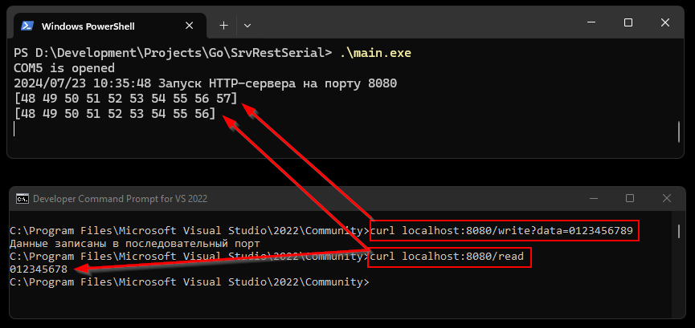

### SrvRestSerial
___

The Go application is an example of an asynchronous serial port server for REST requests.

Requirements:
- Go 1.22.3
- github.com/tarm/serial

---
### How to build
~~~bash
$ cd SrvRestSerial
$ go mod init SrvRestSerial
$ go mod tidy
$ go get github.com/tarm/serial
$ go build main.go
~~~

---
### How to use

Fig1. Example1